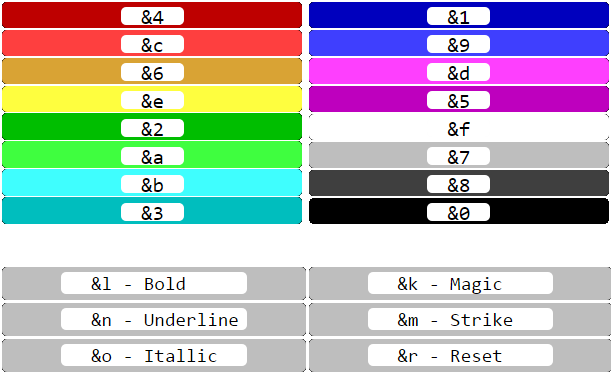

# Minecraft Status-Plugin
Paper 1.18.1 plugin that allows you to configure statuses which players can choose with `/status`.


## How to configure and install
When running the plugin the first time, a folder called `StatusPlugin` should appear. Modify the `config.yml` file
in there to fit your needs.

Example config file:
```yaml
statuses:
- none: ''
- redstoner: '&c[REDSTONER] '
```
"none" & "redstoner" are the names of the status which get suggested when typing `/status`.
The text behind the colons defines how the status should be displayed.
These are the color codes:


### Please report bugs!
